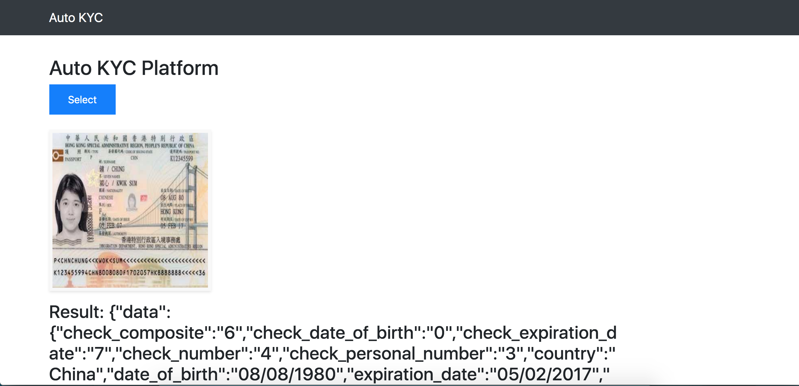

# Auto KYC


## Getting Started

1) Clone Repo
    ```
    $ git clone https://github.com/viraja1/auto_kyc.git
    ```
2) Change directory
    ```
    $ cd auto_kyc
    ```

3) Install Requirements
    ```
    $ pip install -r requirements.txt
    ```
 
4) Subscribe to Passport Data Page Detection ML model from AWS Marketplace and deploy it from Sagemaker UI  
   https://aws.amazon.com/marketplace/pp/GTRIIP-Passport-Data-Page-Detection/prodview-rwowi35gavzww
   
   Note down the name that you gave for sagemaker endpoint
   
5) Configure environment variables for your AWS account & Sagemaker endpoint

   ```
   export SAGEMAKER_ENDPOINT=''
   export AWS_ACCESS_KEY=''
   export AWS_SECRET_KEY=''
   export AWS_REGION=''
   ```   
   
6) Run Server
   ```
   $ python app.py
   ``` 
7) Open http://127.0.0.1:8080 in browser and use the UI to test Auto KYC

8) Try CURL requests
   ```
   $ curl -X POST -F file=@passport.jpg http://127.0.0.1:8080/auto_kyc
   ```

## Screenshots



