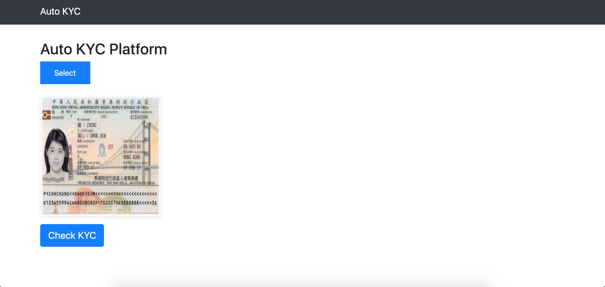
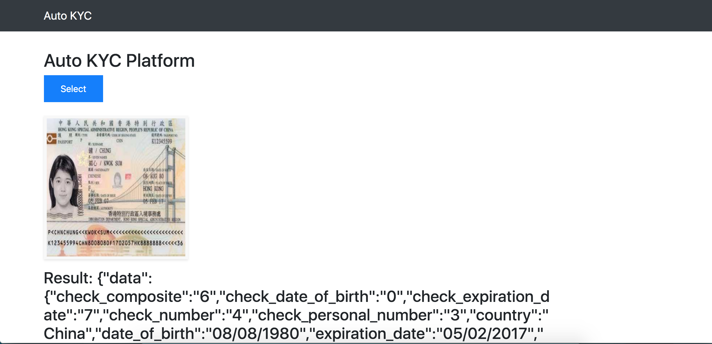
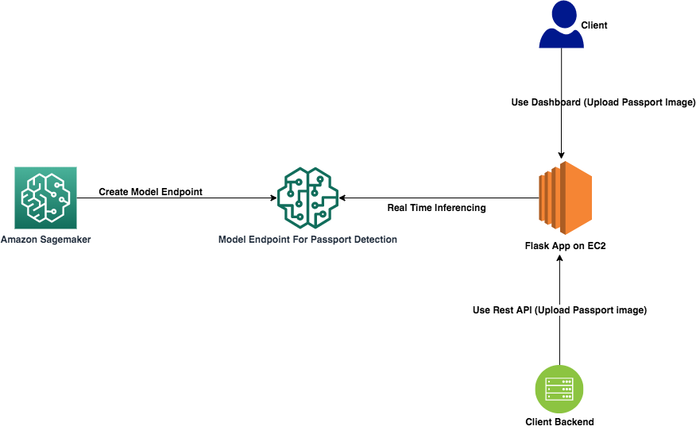

# Auto KYC

## Inspiration
Major institutions have reported spending up to $500 million per year on KYC (Know Your Customer) and customer due diligence. The KYC process is very manual and affects customer experience. Automated KYC checks can result in huge cost savings for the institutions and provide better customer experience to the end users.

## What it does
Auto KYC is an automated KYC Platform for fintech, airlines, hospitality industry, etc. It allows the customer's passport to be uploaded using a dashboard or via a REST API. It then gives various details like whether the passport is valid, expiry date, nationality, name, passport number, etc. All of these details can be automatically entered in your database and you can then redirect the user to the different flows if the passport is valid. Hence Auto KYC provides an Automated KYC Verification Solution for Businesses.

## How I built it
Auto KYC is built using python, flask and AWS Sagemaker. It uses the "Passport Data Page Detection" ML model from the AWS marketplace.

## Getting Started

1) Clone Repo
    ```
    $ git clone https://github.com/viraja1/auto_kyc.git
    ```
2) Change directory
    ```
    $ cd auto_kyc
    ```

3) Install Requirements
    ```
    $ pip install -r requirements.txt
    ```
 
4) Subscribe to Passport Data Page Detection ML model from AWS Marketplace and deploy it from Sagemaker UI  
   https://aws.amazon.com/marketplace/pp/GTRIIP-Passport-Data-Page-Detection/prodview-rwowi35gavzww
   
   Note down the name that you gave for sagemaker endpoint
   
5) Configure environment variables for your AWS account & Sagemaker endpoint

   ```
   export SAGEMAKER_ENDPOINT=''
   export AWS_ACCESS_KEY=''
   export AWS_SECRET_KEY=''
   export AWS_REGION=''
   ```   
   
6) Run Server
   ```
   $ python app.py
   ``` 
7) Open http://127.0.0.1:8080 in browser and use the UI to test Auto KYC

8) Try CURL requests
   ```
   $ curl -X POST -F file=@data/passport.jpg http://127.0.0.1:8080/auto_kyc
   ```
   
9) Sample input and output are present in the [data](data) folder   

## Screenshots




## Architecture Diagram


